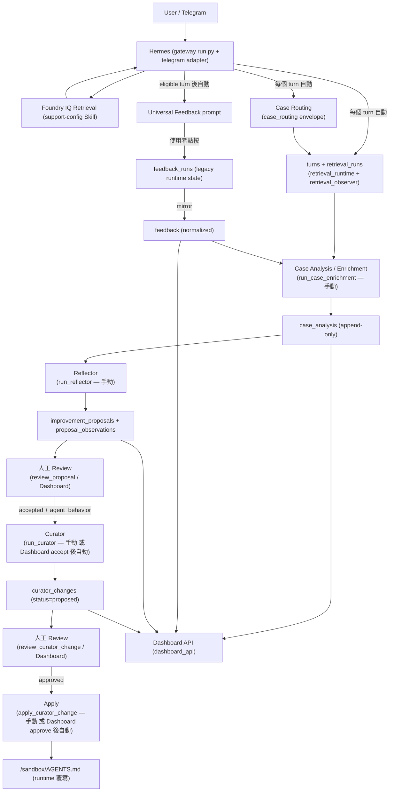
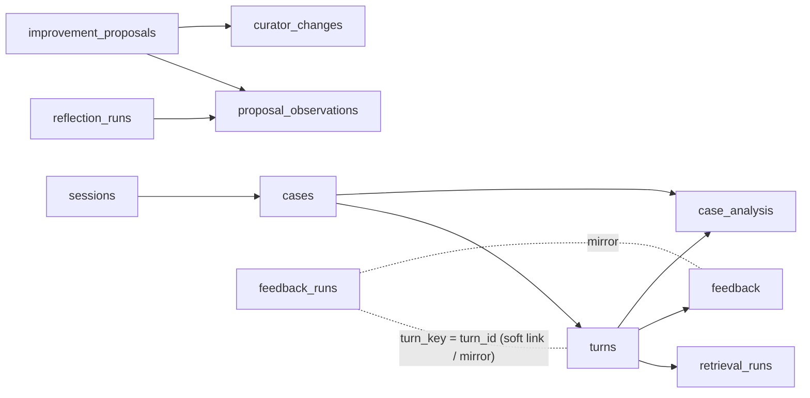

# Advantech Hermes Feedback

Hermes Agent（跑在 NemoClaw sandbox 上）的 **Feedback 與 Support Intelligence 擴充層**。

這個 repo 以 overlay 的方式，在 Hermes 既有的 Telegram 對話流程上加入：從使用者回饋
收集、Session / Turn / Retrieval 觀測落地、Case 路由與分析，到跨 Case 的改善提案
（Reflector）、AGENTS.md 變更提案（Curator），再到給 Dashboard 前端用的唯讀 /
審查 API。

> 本 README 以目前 `main`（已整合 `feature/reflector-context-projection`）的實際
> code 為準。Database 欄位層級的完整參考請見
> [docs/DATABASE_DICTIONARY.md](docs/DATABASE_DICTIONARY.md)。

---

## 1. Project Overview

本 repo 提供一條「互動 → 案件情報 → 持續改善」的資料鏈，全部落在同一個 SQLite
檔案（`/sandbox/.hermes/data/support_feedback.db`）：

| 能力 | 說明 |
|---|---|
| **Universal Feedback** | Telegram 回答後送出 inline keyboard（👍 有幫助 / 👎 需改善），收集 helpful、負向原因（reason code）、選填文字建議（suggestion）。 |
| **Session / Turn / Retrieval persistence** | 每個 Hermes turn 落地成 `sessions` / `cases` / `turns` 三層，加上 Foundry IQ retrieval 的**安全 telemetry**（不存文件內容，只存狀態 / 數量 / 錯誤）。 |
| **Case Routing** | 由主模型在最終回答前輸出一段 machine-readable 控制封包，決定此 turn 歸入既有 Case 或開新 Case。 |
| **Case Analysis / Enrichment** | 手動批次執行的 LLM 分析，為每個 Case 產出 title / issue type / diagnosis / product model / confidence / evidence，append-only 存入 `case_analysis`。 |
| **Reflector** | 手動批次執行的跨 Case 分析，找出 recurring pattern，產出 / 更新 **Improvement Proposal** 及其 **Proposal Observation**。 |
| **Reflector context projection** | 把 `ReflectorInput` + 既有 Proposal candidates 投影成一份最小、確定性、面向 LLM 的 `ReflectorPromptContext`（見 §3）。 |
| **Curator** | 針對「已被人工 accept、且 `improvement_target=agent_behavior`」的 Proposal，用 LLM 產出一份**尚未套用**的 `/sandbox/AGENTS.md` 完整替換提案。 |
| **Curator Change Review / Apply** | 人工 approve/reject → deterministic guard 檢查 → 原子寫檔套用到 runtime AGENTS.md。 |
| **Dashboard API** | 一支獨立的 FastAPI app（`dashboard_api`），對外提供 Overview / Cases / Improvements 的唯讀資料與人工審查 endpoint。**本 repo 只含 backend，frontend 在其他 repository。** |
| **Hermes Core integration** | 少量 Hermes 原生 Core 檔案以 full-file overlay 方式覆蓋，插入上述功能所需的 lifecycle hook（見 §4）。 |

### 與 `advantech-hermes-support-config` 的關係

| Repo | 職責 |
|---|---|
| `advantech-hermes-support-config` | Agent 設定：`AGENTS.md`、`SOUL.md`、Foundry IQ retrieval Skill（`skills/foundry-iq/`）、`scripts/bootstrap_agents.sh`。 |
| `advantech-hermes-feedback`（本 repo） | Interaction（Feedback）、Case Intelligence（Routing / Analysis）、Continuous Improvement（Reflector / Curator）、Dashboard backend、以及必要的 Hermes Core overlay。 |

Curator 產出的 AGENTS.md 變更**只寫回 runtime 的 `/sandbox/AGENTS.md`（一份可拋棄的
工作副本）**，不會寫回 support-config repo、不碰 Git。

---

## 2. Overall Flow



重點差異（相對舊文件）：

- Feedback 不再「按下 👎 就結束」——負向原因選單與選填建議都已實作。
- Case Routing 沒有「fallback default case」的舊說法；未帶 Phase 4 routing context 的
  legacy 呼叫才會走「每個 session 一個 deterministic default case」，其餘一律走
  `case-router-v1` 的判定 / fallback 分類（見 §3）。
- Case Analysis、Reflector、Curator、Apply **沒有 scheduler**，見 §7。

---

## 3. Code Structure by Function

程式全部在 `custom/universal-feedback/overlay/` 下。以下依功能群組介紹。

### Feedback

**功能：**

Telegram 回答後的完整回饋收集：送出 👍/👎 → 若 👎 則出現原因選單（5 個 reason code）
→ 送出後可直接回覆該訊息補充一段文字建議（選填）。所有 callback 都做 fail-closed 授權
（同一 chat、同一原始使用者、綁定同一則 feedback 訊息）。收到結果後即時鏡射到 v2 的
normalized `feedback` 表。

**相關程式：**

| File | Role |
|---|---|
| `overlay/tools/universal_feedback.py` | 純函式：turn key、feedback eligibility policy、secret redaction、Foundry 呼叫標記、`POLICY_VERSION` |
| `overlay/tools/feedback_callbacks.py` | 解析 `fb:h` / `fb:u` / `fb:r:<run_id>:<reason_code>` callback data；`REASON_CODES` 權威清單 |
| `overlay/tools/feedback_storage.py` | Legacy `feedback_runs` 的 SQLite 存取（`FeedbackStore`）：授權綁定 + 收集狀態；`BASE_COLUMNS` 是此表的 runtime DDL |
| `overlay/tools/feedback_store_v2.py` | v2 全部表的 SQLite 存取（`FeedbackStoreV2`）；`submit_feedback` / `add_suggestion` 是 feedback 鏡射的落點 |
| `overlay/tools/feedback_mirror.py` | Phase 3B：legacy 寫入成功後，把結果鏡射進 v2 `feedback`（fail-closed，永不影響使用者體驗） |
| `overlay/plugins/platforms/telegram/adapter.py` | Telegram runtime：送 prompt、inline keyboard、原因選單、callback 授權、suggestion 回覆攔截、呼叫 mirror（vendored full-file overlay，見 §4） |

**相關資料表：** `feedback_runs`（legacy runtime state）、`feedback`（normalized analysis record）、`turns`

**名詞澄清：**

- `feedback_runs` = **Telegram Feedback 的 interaction / runtime state**。目前 Telegram
  runtime 直接依賴它（授權綁定、兩階段 reason→suggestion），**不是已廢棄的表**。
- `feedback` = **normalized analysis record**（一 Turn 一列，帶 policy version），供
  Case Enrichment / Reflector / Dashboard 分析用。
- 兩者以 `feedback_runs.turn_key == turns.turn_id` 為 soft link，靠 `feedback_mirror`
  單向鏡射。詳見 [docs/DATABASE_DICTIONARY.md](docs/DATABASE_DICTIONARY.md) 的
  〈Legacy vs v2 Feedback〉。

### Turn / Retrieval

**功能：**

每個 Hermes turn 完成後，把該 turn 落地為 `sessions` / `cases` / `turns`，並解析該 turn
內 0..n 次 Foundry IQ retrieval 呼叫的**安全 telemetry**。**不保存 retrieved documents
本身**——只存 retrieval 是否 / 如何執行、result / reference 數量、錯誤碼、以及這份觀察
本身有多可信（`observation_status`）。

**相關程式：**

| File | Role |
|---|---|
| `overlay/tools/retrieval_observer.py` | 純 parser：把一個 turn 的 message list 解析成 `TurnRetrievalObservation`（結構上無法承載文件內容 / 密鑰） |
| `overlay/tools/retrieval_runtime.py` | Gateway glue：唯一同時懂 gateway response envelope 與 `FeedbackStoreV2` 的模組；`observe_and_persist_turn` / `build_turn_observation_context` / `persist_turn_observation_context` 三個 fail-closed 進入點；也含 Case Routing 的判定政策（見下） |
| `overlay/tools/feedback_store_v2.py` | `create_turn` / `add_retrieval_runs` / `create_or_update_session` / `create_case` |

**相關資料表：** `sessions`、`cases`、`turns`、`retrieval_runs`

### Case Routing

**功能：**

在 session 已有 Case 時，gateway 把候選 Case（`case_id` + 首 / 末使用者問句）附加到
ephemeral system prompt，要求主模型在最終回答**最前面**輸出一段控制封包：

```
<case-routing>{"case_action":"existing|new|uncertain","case_id":"<id or null>","confidence":0.0,"routing_version":"case-router-v1"}</case-routing>
```

封包只在它是回答的**絕對前綴**時才有協定意義；streaming 時由 `_StreamEnvelopeFilter`
即時遮蔽，`run_conversation()` 回傳後由 `parse_and_strip_prefix` 從權威的
`final_response` 重新解析（顯示遮蔽與 routing 判定是兩套獨立機制）。

**判定政策（`retrieval_runtime._resolve_case_assignment`，`case-router-v1`）：**

| 情況 | 結果 | `case_assignment_method` |
|---|---|---|
| 未帶 Phase 4 routing context（legacy caller） | 每個 session 一個 deterministic default case | `phase3_default` |
| candidate Case 查詢失敗 | 開新 Case（deterministic per-turn id） | `case_router_v1_candidate_context_unavailable` |
| 確認 session 尚無任何 Case | 開新 Case | `case_router_v1_first_turn` |
| 無封包 / `absent` | 開新 Case | `case_router_v1_fallback_missing` |
| 封包 `invalid`（含未知 case_id） | 開新 Case，**不做「找最接近的 Case」** | `case_router_v1_fallback_invalid` |
| `case_action="uncertain"` | 開新 Case | `case_router_v1_fallback_uncertain` |
| `case_action="new"` | 開新 Case | `case_router_v1_new` |
| `case_action="existing"` 且 case_id 屬於本 session 且 `confidence >= 0.75` | 加入該既有 Case | `case_router_v1_existing` |
| `existing` 但 `confidence < 0.75` | 開新 Case | `case_router_v1_fallback_low_confidence` |

`confidence_threshold = 0.75`（`DEFAULT_CONFIDENCE_THRESHOLD`）；`routing_version =
case-router-v1`（`ROUTING_VERSION`）。persistence 層在寫入前還會再確認 `existing` 的
case_id 真的屬於本 session，否則降級為 fallback。

**相關程式：**

| File | Role |
|---|---|
| `overlay/tools/case_routing.py` | 純 parser / validator / sanitizer：解析並驗證封包、strip 前綴、顯示用清洗（不碰 DB / LLM / config） |
| `overlay/tools/retrieval_runtime.py` | 判定政策（上表）、deterministic case_id 產生、`load_candidate_cases` / `build_case_routing_prompt` |
| `overlay/gateway/run.py` | 插入 candidate 查詢、prompt 組裝、streaming 遮蔽、回傳後解析（見 §4） |

**相關資料表：** `cases`、`turns`（`case_assignment_method` / `case_assignment_confidence` / `case_assignment_classifier_version`）

### Case Analysis

**功能：**

以 Case 為單位（不是 session）整理 evidence：該 Case 所有 turns、retrieval telemetry、
feedback。餵給一次獨立的 LLM 呼叫（`call_llm()`，**不是** `run_conversation()`——不帶
SOUL / memory / Skills / tools / session history，也不會重新查 Foundry IQ）。產出
`CaseEnrichmentResult`：case title、issue summary、issue type（4 值）、diagnosis（5 值，
與 issue type 正交）、product model / source / confidence、evidence（觀察事實清單）。
結果 append-only 存入 `case_analysis`（重跑 = 新列）。

是否查 Foundry IQ：**不會**。Case Enrichment 只分析已觀察到的 evidence。

觸發方式：**手動 CLI，沒有 scheduler**（見 §7）。

**相關程式：**

| File | Role |
|---|---|
| `overlay/tools/case_enrichment.py` | Input / Output contract：`build_case_enrichment_input`（組裝 evidence）、`CaseEnrichmentResult` 結構驗證、`parse_case_enrichment_result` |
| `overlay/tools/case_enrichment_analyzer.py` | 真正的 LLM analyzer：專用 prompt + `call_llm()` + 回應解析；`ANALYSIS_VERSION = case-enrichment-v1` |
| `overlay/tools/run_case_enrichment.py` | 批次 runner CLI：列出待分析 Case → analyze →（非 `--dry-run` 時）`create_case_analysis`；`_resolve_main_runtime()` 從 Hermes `config.yaml` 讀同一組 provider/model |

**相關資料表：** `case_analysis`（讀 `turns` / `retrieval_runs` / `feedback` 作 evidence）

### Reflector

**功能：**

跨 Case 找 recurring pattern。整條鏈都是「先組確定性資料，再交給一次 LLM 呼叫，
再落地」：

- **Reflection Run**（`reflection_runs`）：一次跨 Case 分析執行。唯一 mutable 的分析表，
  `running` → `succeeded`/`failed`。
- **Reflector input**（`case_reflection_input.build_reflector_input`）：某個
  `cases.created_at` window 內每個 Case 的最新 `case_analysis`，加上兩個「缺口」欄位
  （`cases_missing_analysis` / `cases_with_unparseable_analysis`）讓覆蓋不完整無所遁形。
- **Reflector context projection**（`reflector_prompt_context.build_reflector_prompt_context`）：
  把 `ReflectorInput` 與既有的 pending Proposal candidates **投影**成一份最小、
  確定性、面向 LLM 的 `ReflectorPromptContext`。它**只**帶 `analyzed_case_count`
  這一個 operational 數字，刻意排除 `window_case_count` / `coverage_ratio` /
  兩個缺口清單——那些是 pipeline 健康度 metadata，不是 recurring pattern 的證據，
  混進去會讓 Reflector 把「enrichment 覆蓋不足」誤當成「這個問題很罕見」。它也把
  每個 Case 的 `case_analysis` evidence 一併投影，讓 Reflector 看得到「為什麼這個
  Case 被這樣判定」，而不只是最終 verdict。這份 context 每次重新建立、從不落 DB。
- **Proposal matching**（`proposal_matching.py`）：建立既有 Proposal 的最小
  candidate 投影；提供 deterministic validator（`match_existing` 只能指向真的被提供
  的 candidate，且 `improvement_target` 必須一致）。真正「同一個議題還是新議題」的
  語意判斷是 Reflector LLM 的工作，本模組不做字串相似度 / embedding。
- **Improvement Proposal**（`improvement_proposals`）：一個持續追蹤的改善議題
  （identity + 人工審查生命週期）。跨 Run 被「重新觀察」，不重建。
- **Proposal Observation**（`proposal_observations`，append-only）：某次 Run 對某個
  Proposal 的觀察快照——`trend`（5 值）、`pattern_summary`、`possible_cause`（假設，
  非確認 root cause）、`recommended_improvement`、`expected_benefit`、`limitations`、
  `supporting_case_ids` / count、`confidence`。
- **Confidence**：每個 Observation 一個 0.0–1.0。
- **Supporting Cases**：`supporting_case_ids_json`（已 dedupe + sorted JSON array）。
  除 `trend='no_longer_observed'` 外，其他 trend 至少要 1 個支持 Case。

一句話：**Proposal = 持續追蹤的改善議題；Observation = 某次 Reflector 對該議題的
觀察快照。**

觸發方式：**手動 CLI，沒有 scheduler**（見 §7）。

**相關程式：**

| File | Role |
|---|---|
| `overlay/tools/case_reflection_input.py` | `ReflectorInput` contract + `build_reflector_input`（window 版）+ `build_case_intelligence_for_ids`（case_id 版，Curator / Dashboard 共用）+ `is_reflection_eligible` |
| `overlay/tools/reflector_prompt_context.py` | **Reflector context projection**：`ReflectorPromptContext` + `build_reflector_prompt_context` + 確定性 JSON 序列化 |
| `overlay/tools/proposal_matching.py` | `ProposalCandidate` 投影、`build_proposal_candidates`、`ProposalResolution` + `validate_proposal_resolution` |
| `overlay/tools/reflector_proposals.py` | domain contract：`ImprovementProposal` / `ProposalObservation` / `ReflectionResult` + 結構驗證 |
| `overlay/tools/reflector_analyzer.py` | 真正的 LLM analyzer：專用 prompt + `call_llm()` + `parse_reflector_output`（fail-closed，單一 finding 壞就整批 reject）；`REFLECTOR_VERSION = reflector-v1` |
| `overlay/tools/reflector_persistence.py` | `persist_reflection_result`：分兩段 commit（audit row 先，proposals/observations transaction 後） |
| `overlay/tools/run_reflector.py` | 批次 runner CLI：input → eligibility → candidates → context → analyzer → persist |

**相關資料表：** `reflection_runs`、`improvement_proposals`、`proposal_observations`（讀 `case_analysis`）

### Curator / Human Review

**功能：**

把一個**已被人工 accept、且 `improvement_target='agent_behavior'`** 的 Proposal，轉成
一份**尚未套用**的 `/sandbox/AGENTS.md` 變更提案。

- 可進 Curator 的 Proposal：`review_status='accepted'` 且
  `improvement_target='agent_behavior'`。其他 target（`knowledge` / `retrieval` /
  `workflow` / `other`）不進 Curator（AGENTS.md 不是它們的槓桿）。
- Curator 讀的 evidence：該 Proposal + 其最新 Observation + Observation 的
  supporting Cases 的 `case_analysis` + `/sandbox/AGENTS.md` 目前完整內容。
- target file：只有 `/sandbox/AGENTS.md`（`CURATOR_TARGET_FILE`，Python 強制，非 SQL CHECK）。
- change type：`add_rule` / `modify_rule` / `remove_rule` / `no_change_recommended`。
  `no_change_recommended` 是合法且預期的結果，不是失敗。
- 產出：`before_content`（當下完整內容）、`proposed_content`（完整替換內容，**非 diff**；
  `no_change_recommended` 時為 NULL）、`rationale`、`expected_effect`、`confidence`、
  `status='proposed'`。
- **Proposal review**：`pending → accepted/rejected`，純人工（`review_proposal.py` 或
  Dashboard POST）。Curator 從不 accept Proposal。
- **Curator Change review**：`proposed → approved/rejected`，純人工
  （`review_curator_change.py` 或 Dashboard POST）。
- **Apply guard**：套用前檢查 AGENTS.md 目前內容 **== `before_content`**，不符則回
  `source_changed`、不寫檔、`status` 留在 `approved`（之後 AGENTS.md 對齊後仍可重試）。
  寫檔用「同目錄 temp file + `os.replace()`」原子替換。`status='applied'` 一定代表檔案
  現在真的等於 `proposed_content`。
- **自動觸發**：CLI 版全手動。**Dashboard API 版**：`POST /improvements/{id}/review`
  帶 `accepted` 後，會在同一個 HTTP request 內**同步自動呼叫 Curator**；
  `POST /curator-changes/{id}/review` 帶 `approved` 後，同步自動呼叫 Apply。Curator /
  Apply 失敗不會 rollback 已 commit 的 accept / approve。

> 名詞澄清：這裡的 "Curator" 與 Hermes 內建的 `agent.curator.maybe_run_curator()`
> （一個既有、無關的每週 Skill 維護背景工作，由 `gateway/run.py` 呼叫）完全是兩回事。

**相關程式：**

| File | Role |
|---|---|
| `overlay/tools/curator_domain.py` | `CuratorChange` contract + 結構驗證；`CURATOR_TARGET_FILE` |
| `overlay/tools/curator_prompt_context.py` | `CuratorPromptContext` 投影 + 確定性 JSON 序列化 |
| `overlay/tools/curator_analyzer.py` | 真正的 LLM analyzer：專用 prompt + `call_llm()` + `parse_curator_output`（cross-field 驗證委派給 `CuratorChange.__post_init__`） |
| `overlay/tools/run_curator.py` | runner：deterministic guards（accepted / agent_behavior / 有 Observation / AGENTS.md 可讀）→ analyzer → post-LLM guard → `create_curator_change`；`resolve_default_analyzer()` 給 Dashboard 共用 |
| `overlay/tools/review_proposal.py` | CLI：`improvement_proposals.review_status` `pending → accepted/rejected` |
| `overlay/tools/review_curator_change.py` | CLI：`curator_changes.status` `proposed → approved/rejected` |
| `overlay/tools/apply_curator_change.py` | deterministic apply：guards → 原子寫 `/sandbox/AGENTS.md` → `mark_curator_change_applied/failed` |

**相關資料表：** `curator_changes`（讀 `improvement_proposals` / `proposal_observations` / `case_analysis`）

### Dashboard Backend

**功能：**

一支獨立、最小的 FastAPI app，對外提供 Feedback / Case Intelligence / Curator 資料的
唯讀投影與人工審查 endpoint。無 ORM（直接用 `FeedbackStoreV2`），無 router/service
分層。**本 repo 只含此 backend；Dashboard frontend 位於其他 repository。**

主要 endpoint：

| Method + Path | 提供什麼 |
|---|---|
| `GET /overview` | 總量統計：cases / turns / feedback、helpful ratio、負向原因分布、diagnosis 分布、product model 分布、Proposal review_status 分布、curator_changes status 分布 |
| `GET /cases` / `GET /cases/{case_id}` | Case 列表 / 單一 Case 詳情（含 turns、retrieval summary、feedback） |
| `GET /improvements` / `GET /improvements/{proposal_id}` | Proposal 列表 / 單一 Proposal 詳情（含最新 Observation、supporting Cases、**全部** curator_changes 歷史） |
| `GET /curator-changes/{change_id}` | 單一 Curator Change 詳情（含 before / proposed content） |
| `POST /improvements/{proposal_id}/review` | 人工 accept/reject Proposal；accept 後同步自動跑 Curator，結果放回同一 response 的 `curator` 欄位 |
| `POST /curator-changes/{change_id}/review` | 人工 approve/reject Curator Change；approve 後同步自動 Apply |
| `POST /curator-changes/{change_id}/apply` | 手動重試 Apply（例如 `source_changed` 後 AGENTS.md 對齊後） |

Database source：同一個 `FeedbackStoreV2`，指向 `/sandbox/.hermes/data/support_feedback.db`。

**相關程式：**

| File | Role |
|---|---|
| `overlay/dashboard_api/views.py` | 純讀取投影函式（不 import FastAPI）：把 `FeedbackStoreV2` row 轉成 JSON-ready dict |
| `overlay/dashboard_api/app.py` | 薄 HTTP adapter：GET 包 `views`，POST 直接複用 `review_proposal` / `review_curator_change` / `run_curator` / `apply_curator_change` |

啟動方式（未被 gateway 啟動，需獨立啟動）：

```
uvicorn dashboard_api.app:app --host 0.0.0.0 --port 8800
```

---

## 4. Hermes Core Overlay

### A. 我們自行新增的 Module

`overlay/tools/*.py`（除 `adapter.py` 外的全部）與 `overlay/dashboard_api/*.py` 都是
**新增檔**，不是覆蓋 Hermes 原檔。其中 `overlay/tools/_validation.py` 是本專案新增的
共用驗證模組（非 upstream 原檔）。

### B. 直接覆蓋 Hermes 原生 Core 的 full-file overlay

目前有 **3 個** vendored full-file overlay（Dockerfile 逐檔 `COPY` 覆蓋到
`/opt/hermes/...`）：

| Core File | Why Modified | Added Capability |
|---|---|---|
| `overlay/gateway/run.py` | Hermes v0.18.0 沒有提供足夠的外部 lifecycle hook 讓我們在「一次對話 turn 完成」時介入 | 每個 turn 完成後：解析 retrieval telemetry 並落地 `turns` / `retrieval_runs`（`observe_and_persist_turn`）；Case Routing 的 candidate 查詢、prompt 組裝、streaming 遮蔽（`_StreamEnvelopeFilter`）、回傳後解析（`parse_and_strip_prefix`）；在 response dict 上明確標記 `phase3a_boundary_trusted`；eligible turn 後送出 Universal Feedback prompt |
| `overlay/gateway/platforms/base.py` | 非 streaming 的 delivery path 不經過 `run.py` 上面那段，最終送出的 `text_content` 要等到 base 的 media/TTS 抽取管線跑完才確定 | non-streaming leg：用 `run.py` 先前 stash 在 `event.metadata` 的 context，在確定 `text_content` 後呼叫 `persist_turn_observation_context` 落地 turn；並在此送出 Universal Feedback prompt（與 streaming leg 以 `universal_feedback_handled` 互斥） |
| `overlay/plugins/platforms/telegram/adapter.py` | 直接沿用 Hermes 原生 Telegram Adapter，但原生 adapter 沒有 feedback inline keyboard / callback / 原因選單 / suggestion 回覆 / 授權 / mirror | `send_universal_feedback` / `_send_feedback_prompt`（inline keyboard）；`_handle_callback_query` 內的 `fb:h/u/r` 分支；`_authorize_universal_feedback_run`（fail-closed 授權）；負向原因選單（`fb:r:<run_id>:<code>`）；`_try_handle_feedback_suggestion_reply`（攔截對 feedback 訊息的文字回覆）；呼叫 `feedback_mirror.*` 鏡射進 v2 |

### 如何在 vendored 檔中找到整合點

這 3 支檔是整份 upstream copy（`run.py` 約 20000 行），本專案的插入點都帶有固定的
comment 前綴，直接 grep 即可定位（每個 hook 也都用 `logger.debug(...)` 包在自己的
try/except 內，是額外的 grep 錨點）：

| grep 關鍵字 | 對應整合點 |
|---|---|
| `Phase 3A` | Turn / Retrieval observation persistence（`run.py` streaming leg + pre-send context、`base.py` non-streaming leg） |
| `Phase 4A Stage C` / `_StreamEnvelopeFilter` / `Case Routing Control Envelope` | Case Routing：candidate 查詢、prompt 組裝、streaming 遮蔽、回傳後解析 |
| `Phase 3B` | Telegram callback 結果鏡射進 v2 `feedback`（`adapter.py`） |
| `Universal feedback` / `universal_feedback_handled` / `send_universal_feedback` | Feedback prompt 送出 hook（`run.py` + `base.py`，兩 leg 互斥） |
| `--- Feedback callbacks` / `_authorize_universal_feedback_run` / `_try_handle_feedback_suggestion_reply` | Telegram feedback callback / 授權 / suggestion 回覆（`adapter.py`） |
| `from tools.` | 所有 `overlay/tools/*` 的 import 點（多為 function 內 lazy import） |

（"Phase 3A / 3B / 4A" 是本專案開發階段的內部代號，不是 Hermes 的概念。）

### 為什麼不得不修改 Core

本專案大多數能力都寫成新增 Module（`overlay/tools/*`）。但
**Feedback prompt 的送出時機、Turn / Retrieval persistence、Case Routing** 必須介入
Hermes 原生對話 lifecycle：要知道「這個 turn 真的完成且內容已送達」、要拿到該 turn
的 message list 與 history offset、要在最終回答送出前 / 後插入 routing。當時 Hermes
v0.18.0 沒有提供足夠的外部 lifecycle hook / plugin extension point；再加上本次直接
使用 Hermes 原生 Telegram Adapter，所以需要在少數 Core 執行路徑（`run.py`、
`base.py`、`adapter.py`）中插入整合 hook。

若未來改由外部 Web / Middleware 控制 interaction flow，或新版 Hermes 提供正式的
lifecycle hook / plugin extension point，即可評估降低 Core 修改範圍。

### Upgrade Warning

- 目前 Core Overlay 綁定 **Hermes Agent v0.18.0** / **NemoClaw base image**
  （`Dockerfile.universal-feedback` 的 `BASE_IMAGE` pin 一個 `hermes-sandbox-base`
  digest）。Dockerfile 內有版本 guard：若安裝到的 Hermes 不是 `0.18.0` 會直接 build fail
  （「re-review #5254 workaround removal before upgrading Hermes」）。
- Base image 升級後**不能直接沿用**這 3 個 overlay 檔——它們是整份 vendored copy。
- 升級步驟：
  1. 對新版 upstream 的 `run.py` / `platforms/base.py` / `telegram/adapter.py` 重新
     `diff`；
  2. 把本 repo 的整合點（見上表 "Added Capability"）重新套用到新版；
  3. 跑完整 tests（`python -m unittest discover -s custom/universal-feedback/tests`）；
  4. 確認 Dockerfile 的 Hermes 版本 guard 更新到新版號。
- Dockerfile 另有 build-time import guard：`py_compile` + `import` 全部 overlay 模組
  與 `dashboard_api`，任何一個 import 失敗即 build fail。

---

## 5. Database

只給 Overview，欄位層級請見 [docs/DATABASE_DICTIONARY.md](docs/DATABASE_DICTIONARY.md)。

- **Path**：`/sandbox/.hermes/data/support_feedback.db`
- **Engine**：SQLite（Python 內建 `sqlite3`，無 ORM）
- **Legacy + v2 共用同一檔**：legacy `feedback_runs`（1 張）與 v2 的 10 張表在同一個 db（共 11 張）。
- **v2 連線 PRAGMA**：`foreign_keys=ON`、`journal_mode=WAL`、`busy_timeout=5000`。
  legacy 連線不開 `foreign_keys`。
- **主要 tables**：`feedback_runs`、`sessions`、`cases`、`turns`、`retrieval_runs`、
  `feedback`、`case_analysis`、`reflection_runs`、`improvement_proposals`、
  `proposal_observations`、`curator_changes`。



---

## 6. Database Schema / Migrations

- `overlay/migrations/001_universal_feedback.sql` … `007_curator_changes.sql` 存在，
  但**沒有 migration runner**，runtime **不會**依序跑 `001`～`007`。
- **Runtime schema 的 source of truth 是 Python DDL，不是 `migrations/*.sql`：**
  - legacy `feedback_runs`：`overlay/tools/feedback_storage.py` 的 `BASE_COLUMNS`
    （`CREATE TABLE IF NOT EXISTS feedback_runs (...)`）。
  - v2 全部表：`overlay/tools/feedback_store_v2.py` 的 `_SCHEMA_STATEMENTS`
    （全部 `CREATE ... IF NOT EXISTS`）。
- 新 DB 如何建立：第一次建構 `FeedbackStore()` / `FeedbackStoreV2()` 時，以上述
  `CREATE TABLE IF NOT EXISTS` 直接建立目前 shape。Stale dev DB 若停留在舊 shape，
  **不會被 reconcile**——刪檔重建即可。
- `migrations/` 的定位：開發期間的 schema evolution / documentation record。
- **已知落差（維護者請以 Python runtime DDL 為準）**：
  - `cases`：migration 002 有 `title` / `product_model`，runtime DDL **沒有**這兩欄。
  - `case_analysis`：migration 004 的 `diagnosis` 是 6 值（含 `workflow_tool_issue` /
    `unclear_or_other`）且無 `issue_type`；runtime 是 5 值 diagnosis + `issue_type`
    （4 值）+ 兩個 confidence 皆 `NOT NULL` + range CHECK。
  - `retrieval_runs.execution_status`：migration 002 是 8 值，runtime 是 10 值（多
    `blocked` / `unparseable`）。
  - migration 003 / 005 的 12-step ALTER TABLE 重建腳本、以及其中提到的
    `_upgrade_*()` Python 方法**都已不存在**（`05c345f` refactor 移除）。

---

## 7. Manual / Automatic Execution

| Function | Trigger |
|---|---|
| Session / Case / Turn persistence | **每個 Hermes turn 自動**（`run.py` streaming leg / `base.py` non-streaming leg，delivery 確認後） |
| Retrieval observation（`retrieval_runs`） | **每個 Hermes turn 自動**（同上） |
| Case Routing 判定與寫入 | **每個 Hermes turn 自動**（session 已有 Case 時；隨 turn persistence 一起） |
| Universal Feedback prompt 送出 | **每個 eligible turn 自動**（`feedback_eligible()` 通過且尚未 handled） |
| Feedback 收集（helpful / reason / suggestion）+ mirror 進 `feedback` | **Feedback callback 事件觸發**（使用者點按 / 回覆） |
| **Case Analysis / Enrichment** | **手動 CLI**：`python tools/run_case_enrichment.py`（**無 scheduler**） |
| **Reflector** | **手動 CLI**：`python3 tools/run_reflector.py`（**無 scheduler**） |
| Proposal Review（accept / reject） | **手動**：`tools/review_proposal.py` CLI **或** Dashboard `POST /improvements/{id}/review` |
| **Curator** | **手動 CLI**：`python3 tools/run_curator.py --proposal-id ...` **或** Dashboard accept Proposal 後**自動**（同一 HTTP request 內同步） |
| Curator Change Review（approve / reject） | **手動**：`tools/review_curator_change.py` CLI **或** Dashboard `POST /curator-changes/{id}/review` |
| **Apply**（覆寫 `/sandbox/AGENTS.md`） | **手動 CLI**：`tools/apply_curator_change.py` **或** Dashboard approve Curator Change 後**自動**（同一 HTTP request 內同步） |
| `agent.curator.maybe_run_curator()`（Hermes 內建、與本專案無關的每週 Skill 維護） | 由 Hermes 自身 config 的 `interval_hours` 控制（**不是**本專案的 Curator） |

> 接手重點：**Case Analysis 與 Reflector 沒有任何 scheduler / cron / background
> worker**。要產生新的 `case_analysis` / `reflection_runs` 資料，必須手動跑對應的
> runner CLI。

---

## 8. Important Runtime Paths / Config

| 項目 | 值 |
|---|---|
| Feedback DB path | `/sandbox/.hermes/data/support_feedback.db` |
| Runtime AGENTS.md path（Curator apply target） | `/sandbox/AGENTS.md`（`CURATOR_TARGET_FILE`） |
| Dashboard API 埠 | 慣例 `8800`（`uvicorn dashboard_api.app:app --port 8800`）；未被 gateway 自動啟動 |
| Hermes 版本 pin | `0.18.0`（Dockerfile build-time guard 強制） |
| Base image pin | `Dockerfile.universal-feedback` 的 `BASE_IMAGE` ARG（`hermes-sandbox-base` digest） |
| Overlay location（repo） | `custom/universal-feedback/overlay/` |
| Overlay location（image） | `/opt/hermes/gateway/`、`/opt/hermes/gateway/platforms/`、`/opt/hermes/plugins/platforms/telegram/`、`/opt/hermes/tools/`、`/opt/hermes/dashboard_api/`、`/opt/hermes/migrations/` |
| Dockerfile | `Dockerfile.universal-feedback` |
| Foundry IQ 查詢 script（support-config repo） | `/sandbox/hermes-support-config/skills/foundry-iq/scripts/query_foundry_iq.py` |
| LLM runtime config 來源 | Hermes 自身的 `config.yaml`（`model.provider` / `model.default` / `model.base_url` / `model.api_key`）——runner 一律用與主 agent 相同的 provider/model，不 hard-code、不 fallback |
| 相關 environment variable 名稱（**只列名稱**） | `NEMOCLAW_MODEL`、`NEMOCLAW_PROVIDER_KEY`、`NEMOCLAW_UPSTREAM_PROVIDER`、`NEMOCLAW_INFERENCE_BASE_URL`、`NEMOCLAW_INFERENCE_API`、`NEMOCLAW_CONTEXT_WINDOW`、`NEMOCLAW_WEB_SEARCH_ENABLED`、`HERMES_WEB_DIST`、`HERMES_TELEGRAM_DISABLE_FALLBACK_IPS`、`HERMES_ENVIRONMENT_HINT`、`SSL_CERT_FILE`；secret 類（如 Telegram bot token、Foundry IQ Query Key）由 OpenShell L7 proxy 在邊界注入，**絕不入 Git、絕不寫入 DB / log** |

`universal_feedback.py` 內另有一組 secret redaction pattern，會在寫入
`question_text` / `answer_text` / `suggestion_text` 前遮蔽常見憑證字串。

---

## 9. Known Limitations / Handoff Notes

- **SQLite 無 persistent volume**：DB 在 sandbox 內；sandbox 重建即整份消失。POC 可
  接受（資料可由 runner 重新產生），但正式化前需要外部持久化。
- **Sandbox reset 影響**：`/sandbox/.hermes/data/support_feedback.db` 與
  `/sandbox/AGENTS.md`（Curator apply 的目標）都是可拋棄的工作副本；reset 後 Curator
  的變更即消失。
- **Curator 變更不寫回 support-config repo**：`apply_curator_change` 只覆寫 runtime
  `/sandbox/AGENTS.md`，不碰 Git、不碰 support-config repo。要讓變更長存需人工搬回
  support-config。
- **Case Analysis / Reflector / Curator / Apply 全無 scheduler**：見 §7。
- **Core Overlay upgrade risk**：3 個 vendored full-file overlay 綁死 Hermes v0.18.0；
  升級需重新 diff + 重新套用整合點 + 重跑 tests（見 §4 Upgrade Warning）。
- **`migrations/` 非 runtime runner**：且與現行 runtime DDL 有已知落差（見 §6）。
  維護者請一律以 Python DDL 為準。
- **Dashboard 只有 backend**：frontend 在其他 repository，本 repo 不含。
- **`turns.case_assignment_overridden_by` / `case_assignment_overridden_at`**：schema
  有欄位但目前無任何 write path（reserved，未來人工覆寫用）。
- **`agent.auxiliary_client` / `hermes_cli.config` 只存在於 built sandbox image**：本
  repo 的測試環境沒有，所以所有 analyzer / runner 都用 lazy import + 依賴注入；
  runner 若不在 sandbox 內執行會 fail closed。

未來可改善但**刻意未在交接前處理**的較大項目（模組拆分、Core overlay 依賴、
migrations 定位等），另見 [docs/HANDOFF_TECH_DEBT.md](docs/HANDOFF_TECH_DEBT.md)。

---

## Development

```bash
# 全部測試（標準庫 unittest，無外部依賴；使用 temp DB，不碰 runtime db）
python -m unittest discover -s custom/universal-feedback/tests -v

# 手動跑 Case Enrichment（預覽，不寫 DB）
python custom/universal-feedback/overlay/tools/run_case_enrichment.py --dry-run

# 手動跑 Reflector
python3 custom/universal-feedback/overlay/tools/run_reflector.py

# 手動跑 Curator（需已 accept 的 agent_behavior Proposal）
python3 custom/universal-feedback/overlay/tools/run_curator.py --proposal-id <id>
```

Build：`docker build -f Dockerfile.universal-feedback ...`（詳細 ARG 見 Dockerfile）。

### 不可 commit 進 Git

API keys / tokens、env 檔、SQLite runtime db、Telegram 使用者資料、log、sandbox
runtime state、upstream 檔案的備份副本。
