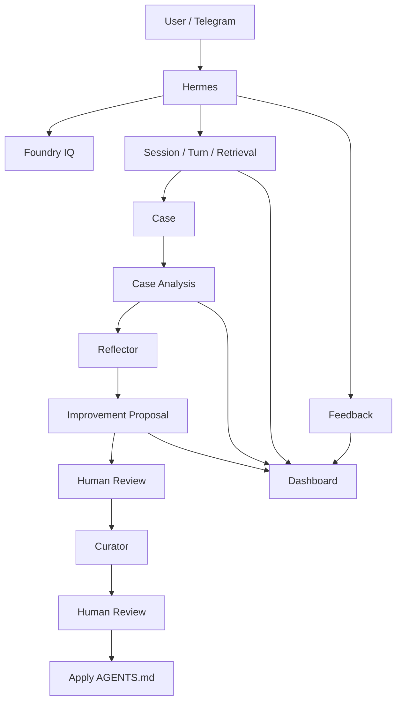

# Advantech Hermes Feedback

本 Repository 為 Hermes Agent 的 Feedback 與 Support Intelligence 擴充功能。

主要在 Hermes 原有的 Telegram 對話流程上加入：

- 使用者 Feedback
- Session / Turn / Retrieval 紀錄
- Case 建立與分類
- Case Analysis
- Reflector 跨 Case 改善分析
- Curator Agent 行為改善
- Dashboard Backend

相關資料統一儲存在 SQLite Database：

```text
/sandbox/.hermes/data/support_feedback.db
```

完整 Database Table 與欄位說明請見：

[`docs/DATABASE_DICTIONARY.md`](docs/DATABASE_DICTIONARY.md)

---

## 1. 與 Support Config Repository 的分工

本專案主要包含兩個 Repository：

| Repository | 主要用途 |
|---|---|
| `advantech-hermes-support-config` | Hermes Agent 設定，包括 `SOUL.md`、`AGENTS.md` 與 Foundry IQ Skill |
| `advantech-hermes-feedback` | Feedback、Case Analysis、Reflector、Curator、Dashboard Backend，以及相關資料紀錄 |

簡單來說：

- `support-config` 負責 **Agent 怎麼回答、怎麼查企業知識**
- `feedback` repo 負責 **記錄實際使用情況，並從使用案例找出改善方向**

---

## 2. Overall Flow



---

# 3. Code Structure

主要程式位於：

```text
custom/universal-feedback/overlay/
```

以下依功能分組介紹。

---

## Feedback

Hermes 回答後會提供「有幫助 / 需改善」按鈕。

若使用者選擇需改善，可以再選擇原因，也可以補充文字建議。這些 Feedback 會被保存，提供後續 Case Analysis、Reflector 與 Dashboard 使用。

### 主要程式

| File | 用途 |
|---|---|
| `tools/universal_feedback.py` | Feedback 共用規則，例如判斷是否需要顯示 Feedback |
| `tools/feedback_callbacks.py` | 處理正負評與負評原因 |
| `tools/feedback_storage.py` | 儲存 Telegram Feedback 互動資料 |
| `tools/feedback_mirror.py` | 將 Feedback 整理到後續分析使用的資料表 |
| `tools/feedback_store_v2.py` | Feedback / Case / Analysis 等資料的主要 Database 存取 |
| `plugins/platforms/telegram/adapter.py` | Telegram Feedback 按鈕、Callback 與 Suggestion Reply |

### 相關資料表

`feedback_runs`、`feedback`

---

## Session / Turn / Retrieval

每次 Hermes 與使用者完成一輪問答後，系統會保存這次對話以及 Foundry IQ 的使用情況。

主要記錄：

- 使用者問了什麼
- Hermes 回答了什麼
- 是否有呼叫 Foundry IQ
- Retrieval 是否成功
- 找到多少結果

系統只保存 Retrieval 的執行資訊，不保存完整 Knowledge Base 文件內容。

### 主要程式

| File | 用途 |
|---|---|
| `tools/retrieval_observer.py` | 整理 Foundry IQ Retrieval 的執行情況 |
| `tools/retrieval_runtime.py` | 將 Session、Turn、Retrieval 與 Case Assignment 寫入 Database |

### 相關資料表

`sessions`、`turns`、`retrieval_runs`

---

## Case Routing

一個實際技術問題可能包含多輪問答，因此系統會把處理同一問題的 Turns 整理成一個 Case。

當新的 Turn 出現時，系統會判斷：

- 是否延續既有 Case
- 或應建立新的 Case

若無法可靠判斷，會偏向建立新的 Case，避免將不同問題錯誤合併。

### 主要程式

| File | 用途 |
|---|---|
| `tools/case_routing.py` | 處理 Case Routing 結果 |
| `tools/retrieval_runtime.py` | 實際建立 Case 或將 Turn 分配到 Case |
| `gateway/run.py` | 將 Case Routing 接入 Hermes 對話流程 |

### 相關資料表

`cases`、`turns`

---

## Case Analysis

Case 建立後，可以進一步將同一 Case 中的：

- Question / Answer
- Retrieval
- Feedback

整理後交由 LLM 分析。

分析結果包括：

- Case Title
- Issue Summary
- Issue Type
- Diagnosis
- Product Model
- Confidence
- Evidence

目前 Case Analysis 為 **手動執行**，沒有自動排程。

### 主要程式

| File | 用途 |
|---|---|
| `tools/case_enrichment.py` | 整理 Case Analysis 的輸入與輸出格式 |
| `tools/case_enrichment_analyzer.py` | 使用 LLM 分析 Case |
| `tools/run_case_enrichment.py` | 手動執行 Case Analysis |

### 相關資料表

`case_analysis`

---

## Reflector

Reflector 會跨多個 Case Analysis 找出重複出現的問題與改善方向。

例如可能發現：

- Agent 回答過度冗長
- Knowledge 存在缺口
- Retrieval 效果不好
- Support Workflow 可以改善

Reflector 會產生 **Improvement Proposal**。

同一個問題後續再次被發現時，不會一直建立新的 Proposal，而是新增一筆 **Proposal Observation**，用來記錄這次觀察到的情況與趨勢。

簡單來說：

> **Proposal = 正在追蹤的改善議題**  
> **Observation = 某一次 Reflector 對這個議題的觀察**

Proposal 也會透過 `improvement_target` 區分改善方向：

- `knowledge`
- `agent_behavior`
- `retrieval`
- `workflow`
- `other`

目前 Reflector 為 **手動執行**，沒有自動排程。

### 主要程式

| File | 用途 |
|---|---|
| `tools/case_reflection_input.py` | 整理 Reflector 要分析的 Cases |
| `tools/reflector_prompt_context.py` | 整理提供給 Reflector LLM 的 Context |
| `tools/reflector_analyzer.py` | 使用 LLM 進行跨 Case 分析 |
| `tools/proposal_matching.py` | 判斷是否已存在相同 Improvement Proposal |
| `tools/reflector_proposals.py` | Proposal / Observation 的資料處理 |
| `tools/reflector_persistence.py` | 儲存 Reflector 結果 |
| `tools/run_reflector.py` | 手動執行 Reflector |

### 相關資料表

`reflection_runs`、`improvement_proposals`、`proposal_observations`

---

## Curator

Curator 負責將已被人工接受的 `agent_behavior` Improvement Proposal，進一步轉換成實際的 Agent Behavior 修改建議。

目前 Curator 修改的目標為：

```text
/sandbox/AGENTS.md
```

流程中保留兩次人工確認：

```text
Improvement Proposal
        ↓
   Accept / Reject
        ↓
      Curator
        ↓
  Curator Change
        ↓
  Approve / Reject
        ↓
       Apply
```

因此 Reflector 或 Curator 不會直接自行修改 Agent。

### 主要程式

| File | 用途 |
|---|---|
| `tools/curator_domain.py` | 定義 Curator Change |
| `tools/curator_prompt_context.py` | 整理 Curator 所需資料 |
| `tools/curator_analyzer.py` | 使用 LLM 產生修改建議 |
| `tools/run_curator.py` | 執行 Curator |
| `tools/review_proposal.py` | Review Improvement Proposal |
| `tools/review_curator_change.py` | Review Curator Change |
| `tools/apply_curator_change.py` | 將核准的修改套用至 AGENTS.md |

### 相關資料表

`improvement_proposals`、`proposal_observations`、`curator_changes`

---

## Dashboard Backend

Dashboard Backend 讀取同一份 `support_feedback.db`，提供 Dashboard Frontend 顯示及操作。

主要包含：

- Overview
- Cases
- Feedback
- Case Analysis
- Improvement Proposals
- Curator Changes
- Proposal / Curator Review

### 主要程式

| File | 用途 |
|---|---|
| `dashboard_api/views.py` | 整理 Dashboard 顯示所需資料 |
| `dashboard_api/app.py` | FastAPI Backend 與 Review API |

Dashboard Frontend 位於另一個 Repository，本 repo 主要負責 Backend。

---

# 4. Hermes Core Modification

本專案大部分功能都是另外新增的 Python Module。

但 Feedback、Turn Persistence 與 Case Routing 必須接入 Hermes 原本的對話流程，因此有修改少數 Hermes Core 檔案。

目前主要修改 3 個檔案：

| Core File | 為什麼修改 | 加入的功能 |
|---|---|---|
| `gateway/run.py` | 需要在 Hermes 問答流程中取得 Turn 與 Retrieval 資料 | Turn / Retrieval 紀錄、Case Routing、Feedback Trigger |
| `gateway/platforms/base.py` | 部分訊息會走不同的 Delivery Path | 補上 Turn 紀錄與 Feedback Hook |
| `plugins/platforms/telegram/adapter.py` | Hermes 原生 Telegram 沒有本專案需要的 Feedback UI | Feedback Button、負評原因、Suggestion Reply |

### 為什麼需要修改 Core？

Hermes v0.18.0 當時沒有提供足夠的 Lifecycle Hook，讓外部 Module 在一次對話完成、訊息送出或 Telegram Callback 發生時取得需要的資料。

因此需要在上述 3 個 Core File 中加入整合點。

> 若未來升級 Hermes，這 3 個檔案需要重新與新版 Hermes 比對並重新套用修改。

---

# 5. Database

Feedback、Case、Analysis 與 Improvement 相關資料統一存在：

```text
/sandbox/.hermes/data/support_feedback.db
```

Database 使用 SQLite。

主要資料關係可以簡單理解為：

```text
Session
  ↓
Case
  ↓
Turn
 ├─ Retrieval
 └─ Feedback

Case
  ↓
Case Analysis
  ↓
Reflector
  ↓
Improvement Proposal
  ↓
Proposal Observation
  ↓
Curator Change
```

完整 Table 與欄位說明請見：

[`docs/DATABASE_DICTIONARY.md`](docs/DATABASE_DICTIONARY.md)

### Schema 注意事項

`migrations/` 保存的是開發期間的 Schema 變更紀錄。

目前 Runtime **不會依序執行 migrations SQL**。

實際使用的 Schema 以：

```text
tools/feedback_storage.py
tools/feedback_store_v2.py
```

中的 Python DDL 為準。

---

# 6. 執行方式

| 功能 | 目前觸發方式 |
|---|---|
| Session / Turn / Retrieval 紀錄 | 每次 Hermes 對話自動 |
| Case Routing | 每次 Hermes 對話自動 |
| Feedback | 使用者互動 |
| Case Analysis | 手動 |
| Reflector | 手動 |
| Proposal Review | 人工 |
| Curator | 手動，或 Dashboard Accept Proposal 後觸發 |
| Curator Change Review | 人工 |
| Apply | 手動，或 Dashboard Approve 後觸發 |

目前 **Case Analysis 與 Reflector 沒有 Scheduler**。

---

# 7. Important Notes

- Runtime Database：`/sandbox/.hermes/data/support_feedback.db`
- Curator 修改目標：`/sandbox/AGENTS.md`
- Dashboard Backend 預設使用 Port `8800`
- Core Overlay 目前基於 Hermes v0.18.0
- Sandbox Reset 後，Runtime Database 與 AGENTS.md 修改可能消失
- Curator Apply 不會自動將修改寫回 `advantech-hermes-support-config` Repository
- `migrations/` 不是目前 Runtime Schema 的 Source of Truth

---

# Development

執行全部 tests：

```bash
python -m unittest discover -s custom/universal-feedback/tests -v
```
