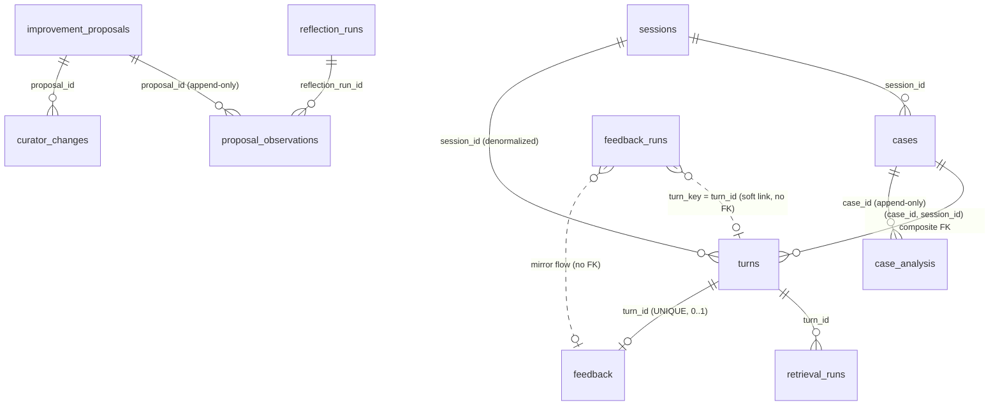

# Database Dictionary — Hermes Feedback / Case Intelligence

本文件是 `advantech-hermes-feedback` runtime SQLite database 的完整參考。

**Source of truth**：本文件以目前 main 的 **Python runtime DDL** 為準，而不是
`custom/universal-feedback/overlay/migrations/*.sql`。

- Legacy `feedback_runs` schema：`overlay/tools/feedback_storage.py` 的 `BASE_COLUMNS`。
- v2 schema（其餘所有 table）：`overlay/tools/feedback_store_v2.py` 的 `_SCHEMA_STATEMENTS`。
- `migrations/*.sql` 只是開發期間的 schema evolution 紀錄，runtime 從不執行它們，
  且部分內容已與現行 runtime DDL 不一致（見文末〈Migrations vs Runtime DDL〉）。

---

# Database Overview

| 項目 | 內容 |
|---|---|
| Engine | SQLite（Python 內建 `sqlite3`，無 ORM） |
| Path | `/sandbox/.hermes/data/support_feedback.db`（`feedback_storage.DEFAULT_PATH`） |
| 建立方式 | 第一次建構 `FeedbackStore()` 或 `FeedbackStoreV2()` 時，以 `CREATE TABLE IF NOT EXISTS` 直接建立目前 shape；沒有 migration runner，也不會逐版套用 `001`～`007` |
| Legacy / v2 關係 | Legacy `feedback_runs` 與 v2 的 11 張 table **共用同一個 db 檔案**；彼此以 `feedback_runs.turn_key = turns.turn_id` 這個 soft link 關聯，沒有 FK |
| PRAGMA（v2 連線，每次 `FeedbackStoreV2._connect()`） | `foreign_keys=ON`、`journal_mode=WAL`、`busy_timeout=5000` |
| PRAGMA（legacy 連線，`FeedbackStore._connect()`） | 無（純 `sqlite3.connect`，`foreign_keys` 未開啟） |
| 一致性慣例 | 所有 `*_at` / `*_watermark` 皆為 `datetime.now(timezone.utc).isoformat()` 字串，lexical 比較等同時間順序 |
| 資料保存 | Sandbox 內無 persistent volume；sandbox 重建即整份 db 消失（POC 可接受，資料可重新產生） |

正式使用中的 Table（共 12 張）：

`feedback_runs`、`sessions`、`cases`、`turns`、`retrieval_runs`、`feedback`、
`case_analysis`、`reflection_runs`、`improvement_proposals`、`proposal_observations`、
`curator_changes`。

（`feedback_store_v2.py` 的 module docstring 只列 9 張 v2 table，未包含
`case_analysis` 之後才加入的表；以本文件為準。）

---

# Relationship Diagram



資料流（append-only 標記處代表「重跑一次就是一列新 row，不 UPDATE」）：

```
sessions → cases → turns → retrieval_runs / feedback → case_analysis (append-only)
reflection_runs + improvement_proposals → proposal_observations (append-only)
improvement_proposals → curator_changes
feedback_runs  ···（mirror / soft link）···  turns / feedback
```

---

## `feedback_runs`

**用途**

Telegram Universal Feedback 的 **interaction / runtime state**。每一次送出 feedback
按鈕時建立一列，負責 callback 授權綁定（哪個 chat、哪個 user、哪則訊息可以按）
與收集到的互動狀態（helpful / reason / suggestion）。這是目前 Telegram runtime
實際依賴的表，**不是已廢棄的表**。DDL 由 `feedback_storage.py` 的 `BASE_COLUMNS`
產生。

**Columns**

| Column | Type | Nullable / Default | Key / Constraint | 說明 |
|---|---|---|---|---|
| `run_id` | TEXT | NOT NULL | PRIMARY KEY | 一次 feedback prompt 的唯一識別碼（`uuid4().hex`） |
| `chat_id` | TEXT | NOT NULL | — | 送出此 prompt 的 Telegram chat id；callback 必須來自同一 chat |
| `resolved` | INTEGER | NULL | — | Legacy `/feedback_test`（已解決 / 尚未解決）流程的結果；Universal 流程不寫此欄 |
| `created_at` | TEXT | NOT NULL | — | prompt row 建立時間 |
| `submitted_at` | TEXT | NULL | — | 使用者首次送出任何 feedback 的時間；非 NULL 即代表此 turn 已收過回饋（first-write-wins） |
| `turn_key` | TEXT | NULL | UNIQUE INDEX（WHERE turn_key IS NOT NULL） | 對應 v2 `turns.turn_id` 的值（`telegram:<chat_id>:<user_message_id>`），mirror 用 |
| `telegram_user_id` | TEXT | NULL | — | 原始提問者的 Telegram user id；Universal callback 強制比對，只有本人能回饋 |
| `feedback_message_id` | TEXT | NULL | — | feedback prompt 訊息本身的 message_id；callback 綁定用 |
| `helpful` | INTEGER | NULL | — | `1`=有幫助、`0`=需改善、`NULL`=尚未作答 |
| `reason_code` | TEXT | NULL | 應用層限制 5 值 | 負向回饋原因（見 Enum），只有 `helpful=0` 時才有值 |
| `suggestion_text` | TEXT | NULL | 應用層 `len<=1000`，會過 secret redaction | 使用者針對負向回饋補充的文字建議（選填） |
| `feedback_send_status` | TEXT | NULL | `sent` / `failed` | prompt 訊息本身是否成功送達 Telegram |

**Relationships**

- `feedback_runs.turn_key` → `turns.turn_id`（soft link，無 FK；同值即同一個 Turn）
- `feedback_runs` →（mirror）→ `feedback`：legacy 寫入成功後，adapter 立即把結果鏡射到 v2 `feedback`

**重要規則 / Enum**

- `run_id` first-write-wins：`submit_helpful` / `submit_negative` / `submit` 的 UPDATE
  都帶 `WHERE ... submitted_at IS NULL`（或更嚴格），已作答的 row 不會被覆寫。
- `submit_negative`：要求 `helpful IS NULL AND reason_code IS NULL AND submitted_at IS NULL`。
- `submit_suggestion`：要求 `helpful=0 AND reason_code IN (...) AND submitted_at IS NOT NULL
  AND suggestion_text IS NULL`，且重新驗證 `(run_id, chat_id, telegram_user_id, feedback_message_id)`
  綁定。
- `get_by_feedback_message_id`：`(chat_id, feedback_message_id)` 若命中多列則 fail closed
  回傳 None（無 DB uniqueness 保證）。
- Stale dev DB 若殘留舊欄位（如早期的 resolution 相關欄位），會被忽略而非 reconcile。

---

## `sessions`

**用途**

一個對話 session。目前等同「一個 Telegram chat 的一段連續互動」。每個 turn 都會
idempotent upsert 一次。

**Columns**

| Column | Type | Nullable / Default | Key / Constraint | 說明 |
|---|---|---|---|---|
| `session_id` | TEXT | NOT NULL | PRIMARY KEY | session 唯一識別碼（由 gateway 提供） |
| `platform` | TEXT | NOT NULL | — | 來源平台，目前恆為 `telegram` |
| `platform_chat_id` | TEXT | NULL | — | 平台端 chat id |
| `created_at` | TEXT | NOT NULL | — | session 首次建立時間 |
| `updated_at` | TEXT | NOT NULL | — | 最後一次 upsert 時間 |

**Relationships**

- `cases.session_id` → `sessions.session_id`
- `turns.session_id` → `sessions.session_id`（透過 `cases` 的 composite FK 間接保證）

**重要規則 / Enum**

- `create_or_update_session` 為 `INSERT ... ON CONFLICT(session_id) DO UPDATE`，
  可安全地在每個 turn 呼叫。

---

## `cases`

**用途**

一個 Case = 一個獨立的技術支援議題。由 Case Routing 決定 turn 要歸到既有 Case 還是
新 Case。**runtime schema 只有 identity 欄位**，沒有 title / product_model
（那些屬於 append-only 的 `case_analysis`）。

**Columns**

| Column | Type | Nullable / Default | Key / Constraint | 說明 |
|---|---|---|---|---|
| `case_id` | TEXT | NOT NULL | PRIMARY KEY | Case 唯一識別碼（deterministic：`case-default-<uuid5>` 或 `case-router-v1-<uuid5>`） |
| `session_id` | TEXT | NOT NULL | REFERENCES `sessions(session_id)`；`UNIQUE(case_id, session_id)` | 此 Case 所屬 session |
| `created_at` | TEXT | NOT NULL | — | Case 首次建立時間；代表「此獨立 Case 事件開始的時間」，Reflector 的分析 window 以此為準 |
| `updated_at` | TEXT | NOT NULL | — | 目前只在建立時寫入一次，之後**沒有任何 write path 會更新它**（reserved） |

**Relationships**

- `cases.session_id` → `sessions.session_id`
- `(turns.case_id, turns.session_id)` → `cases(case_id, session_id)`（composite FK）

**重要規則 / Enum**

- `UNIQUE(case_id, session_id)` 存在只是為了讓 `turns` 的 composite FK 能引用。
- Case Routing 從不跨 session 合併 Case。

---

## `turns`

**用途**

一次 Hermes 問答（一個 user message → 一個 assistant 最終回覆）。是 Turn / Retrieval
telemetry、feedback eligibility、Case assignment 的落地點。也是 Case Enrichment 的
evidence 來源。

**Columns**

| Column | Type | Nullable / Default | Key / Constraint | 說明 |
|---|---|---|---|---|
| `turn_id` | TEXT | NOT NULL | PRIMARY KEY | 一次 Hermes 問答的唯一識別碼；值為 `telegram:<chat_id>:<user_message_id>` |
| `case_id` | TEXT | NOT NULL | composite FK | 此 turn 歸屬的 Case |
| `session_id` | TEXT | NOT NULL | composite FK | denormalized 自 `cases.session_id`（由 storage 於 insert 時推導，不接受 caller 傳入） |
| `platform_user_id` | TEXT | NOT NULL | — | 提問者的平台 user id |
| `platform_user_message_id` | TEXT | NOT NULL | `UNIQUE(session_id, platform_user_message_id)` | 使用者訊息的平台 message id |
| `platform_assistant_message_id` | TEXT | NULL | — | assistant 回覆訊息的平台 message id |
| `question_text` | TEXT | NOT NULL | 過 secret redaction | 使用者原始問題 |
| `answer_text` | TEXT | NOT NULL | 過 secret redaction；已去除 case-routing envelope 前綴 | Hermes 對使用者的最終回答 |
| `feedback_eligible` | INTEGER | NOT NULL | CHECK IN (0,1) | 此 turn 是否符合送出 feedback prompt 的條件 |
| `retrieval_observation_status` | TEXT | NOT NULL DEFAULT `'unavailable'` | CHECK IN (`complete`,`partial`,`unavailable`) | 此 Turn 的 Foundry IQ retrieval 是否能被完整觀察 |
| `retrieval_observation_reason` | TEXT | NULL | 固定字串詞彙 | 非 `complete` 時的固定安全原因（如 `untrusted_turn_boundary`、`retrieval_insert_failed`） |
| `support_config_commit` | TEXT | NULL | — | 產生此回答時 support-config repo 的 commit（provenance） |
| `feedback_code_commit` | TEXT | NULL | — | 產生此回答時 feedback overlay 的 commit（provenance） |
| `hermes_version` | TEXT | NULL | — | Hermes 版本（provenance） |
| `model` | TEXT | NULL | — | 使用的模型名稱 |
| `provider` | TEXT | NULL | — | 使用的 provider |
| `case_assignment_method` | TEXT | NULL | 見 Enum | 此 turn 的 Case 是怎麼決定的 |
| `case_assignment_confidence` | TEXT | NULL | — | 模型回報的 routing confidence（原值字串，即使觸發 fallback 也存真實值） |
| `case_assignment_classifier_version` | TEXT | NULL | — | Case router 版本；Phase 4 routed turn 為 `case-router-v1`，legacy 為 NULL |
| `case_assignment_overridden_by` | TEXT | NULL | — | **reserved / 目前無 write path**（未來人工覆寫用） |
| `case_assignment_overridden_at` | TEXT | NULL | — | **reserved / 目前無 write path** |
| `created_at` | TEXT | NOT NULL | — | turn row 建立時間 |
| `updated_at` | TEXT | NOT NULL | — | turn row 最後更新時間 |

**Relationships**

- `(turns.case_id, turns.session_id)` → `cases(case_id, session_id)`
- `retrieval_runs.turn_id` → `turns.turn_id`
- `feedback.turn_id` → `turns.turn_id`（UNIQUE）
- `turns.turn_id` ← `feedback_runs.turn_key`（soft link）

**重要規則 / Enum**

- `UNIQUE(session_id, platform_user_message_id)`：同一則使用者訊息只會有一個 Turn（retry idempotent）。
- `case_assignment_method` 允許值：
  `phase3_default`（未帶 Phase 4 routing context 的 legacy caller）、
  `case_router_v1_first_turn`（確認 session 尚無 Case）、
  `case_router_v1_existing`、`case_router_v1_new`、
  `case_router_v1_fallback_missing`（無 envelope）、
  `case_router_v1_fallback_invalid`、
  `case_router_v1_fallback_uncertain`、
  `case_router_v1_fallback_low_confidence`、
  `case_router_v1_candidate_context_unavailable`（candidate Case 查詢失敗）。
- retrieval-insert batch 失敗並 rollback 時，`retrieval_observation_status` 會被降級為
  `unavailable`、`retrieval_observation_reason='retrieval_insert_failed'`。

---

## `retrieval_runs`

**用途**

一次 Foundry IQ retrieval 呼叫的**安全 telemetry**。一個 turn 可有 0..n 列。
**不保存任何 retrieved document 內容、完整 terminal 輸出、完整 command、Query Key、
Authorization header、SAS token、response body**——dataclass 結構上就沒有這些欄位。
只記錄 retrieval 是否 / 如何執行成功，以及結果 / reference 的「數量」。

**Columns**

| Column | Type | Nullable / Default | Key / Constraint | 說明 |
|---|---|---|---|---|
| `retrieval_id` | TEXT | NOT NULL | PRIMARY KEY | 一次 retrieval 觀察的唯一識別碼 |
| `turn_id` | TEXT | NOT NULL | REFERENCES `turns(turn_id)`；`UNIQUE(turn_id, invocation_order)` | 此 retrieval 屬於哪個 Turn |
| `invocation_order` | INTEGER | NOT NULL | `UNIQUE(turn_id, invocation_order)` | 在該 Turn 內第幾次呼叫（assistant 發出順序，0 起） |
| `tool_call_id` | TEXT | NULL | — | 對應的 tool call id（配對 tool result 用） |
| `request_attempted` | INTEGER | NULL | CHECK IN (0,1) | Foundry IQ 是否真的送出過 HTTP 請求 |
| `execution_status` | TEXT | NOT NULL | CHECK（10 值，見 Enum） | 此次 retrieval 的執行結果分類 |
| `foundry_iq_ok` | INTEGER | NULL | CHECK IN (0,1) | Foundry IQ inner result 的 `ok` 值 |
| `observation_status` | TEXT | NOT NULL | CHECK IN (`complete`,`partial`,`unavailable`) | 這一列 telemetry 本身有多可信 |
| `observation_reason` | TEXT | NULL | 固定字串詞彙 | 非 `complete` 時的固定原因（如 `outer_result_unparseable`、`foundry_inner_unparseable`、`missing_inner_result`、`tool_result_missing`） |
| `error_code` | TEXT | NULL | 見 Enum | Foundry IQ inner 回報的 error code（原值） |
| `http_status` | INTEGER | NULL | CHECK NULL OR 100..599 | Foundry IQ 回報的 HTTP 狀態碼 |
| `result_count` | INTEGER | NULL | — | 回傳的 documents 數（僅計數，不存內容） |
| `reference_count` | INTEGER | NULL | — | 回傳的 references 數 |
| `foundry_schema_version` | TEXT | NULL | — | Foundry IQ inner JSON 的 schema_version（如 `foundry-iq-result-v2`） |
| `created_at` | TEXT | NOT NULL | — | 這一列寫入時間 |

**Relationships**

- `retrieval_runs.turn_id` → `turns.turn_id`

**重要規則 / Enum**

- `execution_status` 允許值：`completed`、`failed`、`timed_out`、`http_error`、
  `network_error`、`invalid_response`、`no_documents`、`unknown`、`blocked`、`unparseable`。
  - `blocked` = policy 在 Foundry IQ script 執行前就擋下（外層 terminal 可完整讀取），配 `observation_status='complete'`。
  - `unparseable` = 外層或內層結果被截斷 / 佔位 / 格式錯誤，配 `observation_status='partial'`。
- Foundry IQ inner `error_code` → `execution_status` 對照：
  `request_timeout`→`timed_out`、`http_error`→`http_error`、`network_error`→`network_error`、
  `invalid_response`→`invalid_response`、`no_documents`→`no_documents`；
  其他值（`invalid_input`、`missing_query_key`、`internal_error`、未知）→ `failed`。
- 沒有 retrieval 呼叫的 turn = 0 列；不會為了表示「沒呼叫」而寫佔位 row。

---

## `feedback`

**用途**

一個 Turn 的 **normalized analysis record**：把 Telegram 收到的回饋結果標準化成
「一個 Turn 最多一列」的分析用資料。由 `feedback_mirror.py` 在 legacy `feedback_runs`
寫入成功後鏡射過來。

**Columns**

| Column | Type | Nullable / Default | Key / Constraint | 說明 |
|---|---|---|---|---|
| `feedback_id` | TEXT | NOT NULL | PRIMARY KEY | 此 feedback row 的唯一識別碼 |
| `turn_id` | TEXT | NOT NULL | **UNIQUE** REFERENCES `turns(turn_id)` | 對應的 Turn；一個 Turn 只會有一列 feedback |
| `helpful` | INTEGER | NOT NULL | CHECK IN (0,1) | `1`=有幫助、`0`=需改善 |
| `reason_code` | TEXT | NULL | 見 CHECK | 負向回饋原因（見 Enum） |
| `suggestion_text` | TEXT | NULL | — | 使用者補充的文字建議 |
| `feedback_policy_version` | TEXT | NOT NULL | CHECK `length(trim())>0` | 送出當下生效的 feedback 收集政策版本（目前 `universal-message-v1`） |
| `submitted_at` | TEXT | NOT NULL | — | 回饋送出時間 |

**Relationships**

- `feedback.turn_id` → `turns.turn_id`（UNIQUE，0..1）
- 資料來源：`feedback_runs`（mirror，非 FK）

**重要規則 / Enum**

- Table-level CHECK：
  `(helpful=1 AND reason_code IS NULL AND suggestion_text IS NULL)`
  **或** `(helpful=0 AND reason_code IN ('incorrect','incomplete','not_relevant','unclear','other'))`。
- first-write-wins：`turn_id` UNIQUE，第二次 mirror 直接被拒。
- `add_suggestion` 是 guarded UPDATE：只對「已存在、`helpful=0`、尚無 suggestion」的
  row 生效，且不觸碰 `feedback_policy_version`。

---

## `case_analysis`

**用途**

一個 Case 的 **append-only 分析歷史**。每執行一次 Case Enrichment（LLM 分析）就 INSERT
一列，從不 UPDATE。產生 case title / issue type / diagnosis / product model /
confidence / evidence。

**Columns**

| Column | Type | Nullable / Default | Key / Constraint | 說明 |
|---|---|---|---|---|
| `analysis_id` | TEXT | NOT NULL | PRIMARY KEY | 此次分析的唯一識別碼 |
| `case_id` | TEXT | NOT NULL | REFERENCES `cases(case_id)`；`UNIQUE(case_id, analyzed_at)` | 被分析的 Case |
| `case_title` | TEXT | NULL | — | LLM 產生的簡短 Case 標題 |
| `issue_summary` | TEXT | NULL | — | LLM 產生的問題摘要 |
| `issue_type` | TEXT | NOT NULL | CHECK（4 值） | 使用者問的是「哪一類」問題（見 Enum） |
| `issue_type_confidence` | REAL | NOT NULL | CHECK 0.0–1.0 | issue_type 的信心 |
| `diagnosis` | TEXT | NOT NULL | CHECK（5 值） | AI 支援流程「哪裡可能沒做好」的診斷（見 Enum） |
| `diagnosis_confidence` | REAL | NOT NULL | CHECK 0.0–1.0 | diagnosis 的信心 |
| `product_model` | TEXT | NULL | — | 識別到的產品型號（可為 NULL） |
| `product_source` | TEXT | NULL | CHECK IN (`explicit_user_text`,`inference`) OR NULL | 產品型號的來源 |
| `product_confidence` | REAL | NULL | CHECK NULL OR 0.0–1.0 | 產品識別的信心 |
| `evidence_json` | TEXT | NULL | JSON array | 支持結論的觀察事實清單（見 JSON Fields） |
| `analysis_version` | TEXT | NOT NULL | — | 產生此列的 prompt / contract 版本（目前 `case-enrichment-v1`） |
| `analyzed_at` | TEXT | NOT NULL | `UNIQUE(case_id, analyzed_at)` | 此次分析執行時間 |
| `source_evidence_watermark` | TEXT | NOT NULL | — | 此次分析實際看到的 `MAX(turns.created_at, feedback.submitted_at, retrieval_runs.created_at)`；供下次判斷是否有新 evidence |

**Relationships**

- `case_analysis.case_id` → `cases.case_id`

**重要規則 / Enum**

- **Append-only**：`UNIQUE(case_id, analyzed_at)`（不是 `UNIQUE(case_id)`），重跑即新列。
- `product_model` 三欄一致性規則：`product_model` 有值時 `product_source` 與
  `product_confidence` 都必須有值；`product_model` 為 NULL 時兩者都必須是 NULL。
- `issue_type` 允許值：`product_usage_or_application`、
  `product_capability_or_compatibility`、`product_issue`、`other_or_unclear`。
- `diagnosis` 允許值：`knowledge_gap`、`retrieval_issue`、`answer_quality_issue`、
  `other_or_unclear`、`no_issue_detected`。
- `issue_type` 與 `diagnosis` 正交，沒有任何硬性對照。
- `case_title` / `issue_summary` 不會回寫到 `cases`。

---

## `reflection_runs`

**用途**

一次跨 Case 的 Reflector 分析執行紀錄。**唯一 mutable 的分析表**：建立時
`status='running'`，之後單向 transition 到 `succeeded` / `failed`。

**Columns**

| Column | Type | Nullable / Default | Key / Constraint | 說明 |
|---|---|---|---|---|
| `reflection_run_id` | TEXT | NOT NULL | PRIMARY KEY | 一次 Reflection Run 的唯一識別碼 |
| `window_start` | TEXT | NULL | — | 分析 window 起（inclusive）；NULL = 無下界（全部 Case 歷史） |
| `window_end` | TEXT | NULL | — | 分析 window 迄（exclusive）；NULL = 無上界 |
| `started_at` | TEXT | NOT NULL | — | 執行開始時間（= 每個 Observation 的 `observed_at`） |
| `completed_at` | TEXT | NULL | — | 執行結束時間；`running` 時為 NULL |
| `status` | TEXT | NOT NULL | CHECK IN (`running`,`succeeded`,`failed`) | 此次執行的生命週期狀態 |
| `analyzed_case_count` | INTEGER | NOT NULL | CHECK `>= 0` | 這次實際餵給 Reflector 的可用 Case 數（= `ReflectorInput.analyzed_case_count`） |
| `material_change_detected` | INTEGER | NULL | CHECK IN (0,1) | 是否偵測到具實質意義的變化；完成前為 NULL |
| `run_summary` | TEXT | NULL | — | LLM 產生的一句話執行摘要（zh-TW）；完成前為 NULL |
| `reflector_version` | TEXT | NOT NULL | — | Reflector prompt / reasoning policy 版本（目前 `reflector-v1`） |

**Relationships**

- `proposal_observations.reflection_run_id` → `reflection_runs.reflection_run_id`

**重要規則 / Enum**

- `create_reflection_run` 只會插入 `status='running'`；`complete_reflection_run` 做唯一
  一次終態 transition，不能回到 `running`。
- 一列 `reflection_runs` 的意義固定為「analyzer 這次確實被呼叫過」。若 eligibility 不
  足（可分析 Case 太少）或 input 組裝階段就失敗，則**完全不會有 row**。
- Persistence 分兩段 commit：step 1（建立 row）與 step 2（寫 proposals/observations）
  是分開的 transaction，因此「建立了但 step 2 失敗」會留下 `status='failed'` 的 row。

---

## `improvement_proposals`

**用途**

一個**持續追蹤的改善議題**（identity + 人工審查生命週期）。跨多次 Reflection Run
被「重新觀察」，而不是每次重建。不含任何每次觀察會變的內容欄位（那些在
`proposal_observations`）。

**Columns**

| Column | Type | Nullable / Default | Key / Constraint | 說明 |
|---|---|---|---|---|
| `proposal_id` | TEXT | NOT NULL | PRIMARY KEY | 改善議題的唯一識別碼 |
| `improvement_target` | TEXT | NOT NULL | CHECK（5 值） | 這個議題「屬於哪一類改善」（見 Enum） |
| `title` | TEXT | NOT NULL | — | 簡短識別用標題（zh-TW） |
| `review_status` | TEXT | NOT NULL | CHECK IN (`pending`,`accepted`,`rejected`) | **人工**審查狀態；只有人能移動它 |
| `created_at` | TEXT | NOT NULL | — | 首次被偵測（= 其第一個 Observation 的 `observed_at`）的時間 |

**Relationships**

- `proposal_observations.proposal_id` → `improvement_proposals.proposal_id`
- `curator_changes.proposal_id` → `improvement_proposals.proposal_id`

**重要規則 / Enum**

- `improvement_target` 允許值：`knowledge`、`agent_behavior`、`retrieval`、`workflow`、`other`。
- `review_status` 由 `pending` 起，只能由人透過 `update_proposal_review_status()`
  （CLI `review_proposal.py` 或 Dashboard API）移動；任何 AI / Reflector code path
  都不會改它。`implemented` / `resolved` / `archived` 尚未存在。
- `improvement_target='agent_behavior'` 只是分類，**絕非**允許任何程式自動修改
  Hermes 行為 / KB / Skill / SOUL。

---

## `proposal_observations`

**用途**

某一次 Reflection Run 對某個 Proposal 的**觀察快照**（append-only 歷史）。承載這次
觀察的敘述內容、趨勢、支持 Case、信心。

一句話：**Proposal = 持續追蹤的改善議題；Observation = 某次 Reflector 對該議題的觀察快照。**

**Columns**

| Column | Type | Nullable / Default | Key / Constraint | 說明 |
|---|---|---|---|---|
| `observation_id` | TEXT | NOT NULL | PRIMARY KEY | 此觀察的唯一識別碼 |
| `proposal_id` | TEXT | NOT NULL | REFERENCES `improvement_proposals(proposal_id)`；`UNIQUE(proposal_id, reflection_run_id)` | 被觀察的 Proposal |
| `reflection_run_id` | TEXT | NOT NULL | REFERENCES `reflection_runs(reflection_run_id)` | 產生此觀察的 Reflection Run |
| `trend` | TEXT | NOT NULL | CHECK（5 值） | 相對上一次觀察，支持證據的變化趨勢（見 Enum） |
| `pattern_summary` | TEXT | NOT NULL | — | 觀察到什麼 recurring pattern（整段敘述，zh-TW） |
| `possible_cause` | TEXT | NULL | — | 有證據支持的**假設**成因（非確認 root cause） |
| `recommended_improvement` | TEXT | NOT NULL | — | 建議怎麼做（整段敘述） |
| `expected_benefit` | TEXT | NULL | — | 改善後可能達成什麼 |
| `limitations` | TEXT | NULL | — | 此觀察已知的 caveat |
| `supporting_case_ids_json` | TEXT | NOT NULL | JSON array（已 dedupe + sorted） | 支持此 pattern 的 case_id 清單 |
| `supporting_case_count` | INTEGER | NOT NULL | CHECK `>= 0`，須 == JSON 長度 | 支持 Case 數 |
| `confidence` | REAL | NOT NULL | CHECK 0.0–1.0 | 此觀察的整體信心 |
| `observed_at` | TEXT | NOT NULL | `UNIQUE(proposal_id, observed_at)` | 此觀察時間（= 該 Run 的 `started_at`） |

**Relationships**

- `proposal_observations.proposal_id` → `improvement_proposals.proposal_id`
- `proposal_observations.reflection_run_id` → `reflection_runs.reflection_run_id`
- `supporting_case_ids_json` 內每個 id → `cases.case_id`（值層級，非 FK）

**重要規則 / Enum**

- **Append-only**；`UNIQUE(proposal_id, reflection_run_id)` = 一個 Proposal 每個 Run 最多一列。
- `trend` 允許值：`new`、`growing`、`stable`、`declining`、`no_longer_observed`。
- 只有 `trend='no_longer_observed'` 可以 `supporting_case_count = 0`；其他 trend 至少要 1 個支持 Case。
- `trend='no_longer_observed'` ≠ `review_status='rejected'`：前者只是「目前證據不再支持」。
- 每個 `new_proposals` 一定伴隨一個 founding observation。

---

## `curator_changes`

**用途**

一次 Curator 執行對 `/sandbox/AGENTS.md` 提出的**單一、尚未套用**的變更提案。一個
accepted、`agent_behavior` 的 Proposal 可跑多次 Curator，每次都是新列（不 UPDATE
內容），但 `status` 會隨審查 / 套用而變動。

**Columns**

| Column | Type | Nullable / Default | Key / Constraint | 說明 |
|---|---|---|---|---|
| `change_id` | TEXT | NOT NULL | PRIMARY KEY | 此變更提案的唯一識別碼 |
| `proposal_id` | TEXT | NOT NULL | REFERENCES `improvement_proposals(proposal_id)` | 此變更來自哪個 Proposal |
| `target_file` | TEXT | NOT NULL | 應用層限制 == `/sandbox/AGENTS.md` | 目標檔案（v1 只允許 AGENTS.md；非 CHECK，由 Python 強制） |
| `change_type` | TEXT | NOT NULL | CHECK（4 值） | 變更種類（見 Enum） |
| `rationale` | TEXT | NOT NULL | — | 變更理由（給人看，zh-TW） |
| `before_content` | TEXT | NOT NULL | — | 產生此提案時 AGENTS.md 的**完整**內容 |
| `proposed_content` | TEXT | NULL | 見 Enum 規則 | 提議的 AGENTS.md **完整**替換內容（非 diff）；`no_change_recommended` 時為 NULL |
| `expected_effect` | TEXT | NULL | — | 預期效果（給人看） |
| `confidence` | REAL | NOT NULL | CHECK 0.0–1.0 | Curator 對此變更的信心 |
| `status` | TEXT | NOT NULL | CHECK（5 值） | 審查 / 套用生命週期（見 Status Lifecycles） |
| `created_at` | TEXT | NOT NULL | — | 提案建立時間 |
| `reviewed_at` | TEXT | NULL | — | 人工 approve / reject 時間 |
| `applied_at` | TEXT | NULL | — | 成功套用到 AGENTS.md 的時間 |

**Relationships**

- `curator_changes.proposal_id` → `improvement_proposals.proposal_id`

**重要規則 / Enum**

- `change_type` 允許值：`add_rule`、`modify_rule`、`remove_rule`、`no_change_recommended`。
- `proposed_content` 規則：`add_rule` / `modify_rule` / `remove_rule` 必須有非空內容；
  `no_change_recommended` 必須為 NULL（不可把原內容原樣填回）。
- `status` 允許值：`proposed`、`approved`、`rejected`、`applied`、`failed`。
- Apply guard：套用前會檢查 AGENTS.md 目前內容 **== `before_content`**，不符則回
  `source_changed`、不寫檔、`status` 保持 `approved`。

---

# Enum / Allowed Values

| 名稱 | 適用欄位 | 允許值 |
|---|---|---|
| helpful | `feedback_runs.helpful`、`feedback.helpful` | `1`（有幫助）、`0`（需改善）、`feedback_runs` 另允許 `NULL`（未作答） |
| reason_code | `feedback_runs.reason_code`、`feedback.reason_code` | `incorrect`、`incomplete`、`not_relevant`、`unclear`、`other` |
| feedback_send_status | `feedback_runs.feedback_send_status` | `sent`、`failed` |
| feedback_policy_version | `feedback.feedback_policy_version` | 目前恆為 `universal-message-v1`（`universal_feedback.POLICY_VERSION`） |
| retrieval observation status | `turns.retrieval_observation_status`、`retrieval_runs.observation_status` | `complete`、`partial`、`unavailable` |
| retrieval execution status | `retrieval_runs.execution_status` | `completed`、`failed`、`timed_out`、`http_error`、`network_error`、`invalid_response`、`no_documents`、`unknown`、`blocked`、`unparseable` |
| Foundry IQ error_code | `retrieval_runs.error_code` | 由 `query_foundry_iq.py` 提供的原值；observer 已知並對照的子集：`request_timeout`、`http_error`、`network_error`、`invalid_response`、`no_documents`；其餘（`invalid_input`、`missing_query_key`、`internal_error`、未知）歸入 `execution_status='failed'` |
| case_assignment_method | `turns.case_assignment_method` | `phase3_default`、`case_router_v1_first_turn`、`case_router_v1_existing`、`case_router_v1_new`、`case_router_v1_fallback_missing`、`case_router_v1_fallback_invalid`、`case_router_v1_fallback_uncertain`、`case_router_v1_fallback_low_confidence`、`case_router_v1_candidate_context_unavailable` |
| case_action（in-flight，不落 DB） | Case Routing envelope | `existing`、`new`、`uncertain` |
| routing_version | Case Routing envelope、`turns.case_assignment_classifier_version` | `case-router-v1`（threshold `0.75`） |
| issue_type | `case_analysis.issue_type` | `product_usage_or_application`、`product_capability_or_compatibility`、`product_issue`、`other_or_unclear` |
| diagnosis | `case_analysis.diagnosis` | `knowledge_gap`、`retrieval_issue`、`answer_quality_issue`、`other_or_unclear`、`no_issue_detected` |
| product_source | `case_analysis.product_source` | `explicit_user_text`、`inference`（或 NULL） |
| analysis_version | `case_analysis.analysis_version` | 目前 `case-enrichment-v1` |
| reflection status | `reflection_runs.status` | `running`、`succeeded`、`failed` |
| reflector_version | `reflection_runs.reflector_version` | 目前 `reflector-v1` |
| improvement_target | `improvement_proposals.improvement_target` | `knowledge`、`agent_behavior`、`retrieval`、`workflow`、`other` |
| proposal review_status | `improvement_proposals.review_status` | `pending`、`accepted`、`rejected` |
| proposal trend | `proposal_observations.trend` | `new`、`growing`、`stable`、`declining`、`no_longer_observed` |
| proposal resolution action（in-flight，不落 DB） | Reflector 輸出 | `match_existing`、`create_new` |
| curator change_type | `curator_changes.change_type` | `add_rule`、`modify_rule`、`remove_rule`、`no_change_recommended` |
| curator status | `curator_changes.status` | `proposed`、`approved`、`rejected`、`applied`、`failed` |

---

# Status Lifecycles

### `reflection_runs.status`

```
(建立) → running ──► succeeded
                └──► failed        （step 2 proposals/observations transaction 失敗）
```

- 只有 `create_reflection_run` 能寫入 `running`。
- `complete_reflection_run` 做唯一一次終態轉換，不可逆、不可回到 `running`。
- eligibility 不足 / input 組裝失敗 → 完全沒有 row。

### `improvement_proposals.review_status`

```
(建立) → pending ──► accepted    （人工，review_proposal.py 或 Dashboard POST）
                 └──► rejected    （人工）
```

- 純人工生命週期；AI / Reflector 從不改。
- `not_pending` 保護：已審查過的 Proposal 不會被第二次操作覆寫。

### `curator_changes.status`

```
(建立) → proposed ──► approved ──► applied   （apply 成功寫檔 + DB 標記）
             │            │      └──► failed  （寫檔本身 raise）
             │            └──► （source_changed：不寫檔，狀態留在 approved，可稍後重試）
             └──► rejected                    （人工）
```

- `create_curator_change` 只寫 `proposed`。
- `proposed → approved/rejected`：`review_curator_change.py` 或 Dashboard POST。
- `approved → applied/failed`：`apply_curator_change.py` 或 Dashboard 於 approve 後自動觸發。
- `file_written_db_update_failed`：檔已覆寫但 DB 標記失敗（極窄競態），需人工核對。

---

# JSON Fields

### `case_analysis.evidence_json`

`CaseAnalysisEvidence` 物件的 JSON array，每個元素固定三鍵：

```json
[
  {"type": "feedback", "turn_id": "telegram:123:456", "fact": "使用者對此回答按下『需改善』，reason_code=incomplete"},
  {"type": "user_text", "turn_id": "telegram:123:456", "fact": "使用者詢問如何停用 SNMP"}
]
```

- `type` 允許值：`user_text`、`assistant_text`、`retrieval`、`feedback`（來源分類，非結論分類）。
- `fact` 必須是「觀察到的事實」而非結論（僅結構檢查，無內容分類器）。
- `turn_id` 必填。
- 直接透過 `create_case_analysis()` 寫入（繞過 analyzer，如測試）時，此欄可為 NULL / 空 array。

### `proposal_observations.supporting_case_ids_json`

`case_id` 字串的 JSON array，**已 dedupe 且升冪排序**：

```json
["case-router-v1-aaa...", "case-router-v1-bbb..."]
```

- 長度必須等於 `supporting_case_count`。
- 刻意用 JSON array 而非正規化 join table（POC 目前只需 report / drilldown）。

---

# Timestamp Semantics

| 欄位 | 意義 |
|---|---|
| `feedback_runs.created_at` | feedback prompt row 建立 |
| `feedback_runs.submitted_at` | 使用者首次送出任何回饋（first-write-wins gate） |
| `sessions.created_at` / `updated_at` | session 首次建立 / 最後一次 upsert |
| `cases.created_at` | Case 事件開始時間（Reflector window 的依據） |
| `cases.updated_at` | 只在建立時寫一次，之後不更新（reserved） |
| `turns.created_at` / `updated_at` | Turn row 建立 / 更新 |
| `retrieval_runs.created_at` | retrieval 觀察寫入時間 |
| `feedback.submitted_at` | 回饋送出時間 |
| `case_analysis.analyzed_at` | 該次 Case Enrichment 執行時間（append-only key 的一部分） |
| `case_analysis.source_evidence_watermark` | 該次分析實際看到的最新 evidence 時間戳（判斷是否有新資料） |
| `reflection_runs.started_at` | Reflection Run 開始（也是該 Run 每個 Observation 的 `observed_at`） |
| `reflection_runs.completed_at` | Reflection Run 結束（analyzer 回傳後的另一個時間點） |
| `improvement_proposals.created_at` | Proposal 首次被偵測（= 第一個 Observation 的 `observed_at`） |
| `proposal_observations.observed_at` | 該次觀察時間（= 該 Run 的 `started_at`） |
| `curator_changes.created_at` | 變更提案建立 |
| `curator_changes.reviewed_at` | 人工 approve / reject 時間 |
| `curator_changes.applied_at` | 成功套用到 AGENTS.md 的時間 |

---

# Legacy vs v2 Feedback

| | `feedback_runs`（legacy） | `feedback`（v2） |
|---|---|---|
| 定位 | Telegram Feedback **interaction / runtime state**（callback 授權 + 收集狀態） | **normalized analysis record**（一 Turn 一列） |
| 誰在用 | **Telegram runtime 直接依賴**：`adapter.py` 送出 prompt、驗證 callback、寫 helpful / reason / suggestion 都靠它 | Case Enrichment / Reflector / Dashboard 的分析與統計來源 |
| 建立時機 | 送出 feedback prompt 當下（早於使用者作答） | 使用者作答且 legacy 寫入成功後，由 `feedback_mirror.py` 鏡射 |
| Key | `run_id`（每個 prompt 一個） | `feedback_id`；`turn_id` UNIQUE（每個 Turn 一列） |
| 連結 | `feedback_runs.turn_key` == `turns.turn_id`（soft link） | `feedback.turn_id` → `turns.turn_id`（FK） |
| PRAGMA | 連線不開 `foreign_keys` | 連線開 `foreign_keys=ON` + WAL |

**Mirror flow**

```
使用者按下按鈕
  → adapter 授權檢查 → feedback_runs UPDATE（submit_helpful / submit_negative / submit_suggestion）成功
  → feedback_mirror.mirror_positive_feedback / mirror_negative_feedback / mirror_suggestion
  → FeedbackStoreV2.submit_feedback / add_suggestion（turn_id = feedback_runs.turn_key）
```

Mirror 是**單向、fail-closed**：mirror 失敗絕不影響已完成的 legacy 結果或使用者體驗。

**重複的欄位**：`helpful`、`reason_code`、`suggestion_text` 兩張表都有；語意相同，但
`feedback_runs` 版是「Telegram 互動當下寫入的值」，`feedback` 版是「標準化後、
帶 policy version、一 Turn 一列」的值。

**能否刪掉其中一張？**（依目前 code）

- **不能刪 `feedback_runs`**：Telegram callback 授權綁定
  （`run_id` / `chat_id` / `telegram_user_id` / `feedback_message_id` / `feedback_send_status`）
  與兩階段 reason→suggestion 流程完全依賴它，`feedback` 沒有等價欄位。
- **`feedback` 目前可視為衍生資料**：它由 `feedback_runs` 鏡射而來，理論上可從
  `feedback_runs` + `turns` 重建；但 Case Enrichment / Reflector / Dashboard 都直接查
  `feedback`，刪掉需同步改多處查詢，POC 階段不建議。
- 結論：兩張表**因為不同職責而共存**，短期都保留。

---

# Migrations vs Runtime DDL

`migrations/*.sql` 是開發期間的 schema evolution 文件，**runtime 不會執行**，且與現行
Python DDL 有以下已知落差——一律以 Python runtime DDL 為準：

| 位置 | migration 說法 | 現行 runtime DDL |
|---|---|---|
| `cases` | `002` 有 `title`、`product_model` 欄位 | **沒有**這兩欄（只有 `case_id`/`session_id`/`created_at`/`updated_at`/UNIQUE） |
| `case_analysis.diagnosis` | `004` 為 6 值，含 `workflow_tool_issue`、`unclear_or_other` | 5 值：`knowledge_gap`/`retrieval_issue`/`answer_quality_issue`/`other_or_unclear`/`no_issue_detected` |
| `case_analysis.issue_type` | `004` 無此欄 | `NOT NULL`、4 值 CHECK |
| `case_analysis.*_confidence` | `004` `diagnosis_confidence` 可 NULL、無 range CHECK | `diagnosis_confidence`/`issue_type_confidence` 皆 `NOT NULL` + `CHECK 0.0–1.0` |
| `retrieval_runs.execution_status` | `002` 為 8 值 | 10 值（多 `blocked`、`unparseable`） |
| 在地重建腳本 | `003` / `005` 用 12-step ALTER TABLE 重建，並提到 `_upgrade_*()` Python 方法 | 那些 `_upgrade_*()` 方法**已不存在**（`05c345f` refactor 移除）；現在只有 `CREATE TABLE IF NOT EXISTS`，stale DB 保留舊 shape、不 reconcile |

**維護者注意**：要看某張表的真實 schema，讀
`overlay/tools/feedback_store_v2.py` 的 `_SCHEMA_STATEMENTS`
（或 legacy 的 `feedback_storage.py` `BASE_COLUMNS`），不要讀 `migrations/`。
